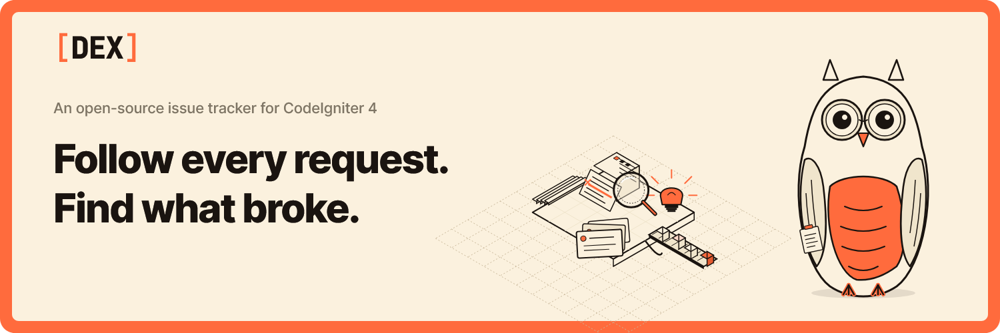
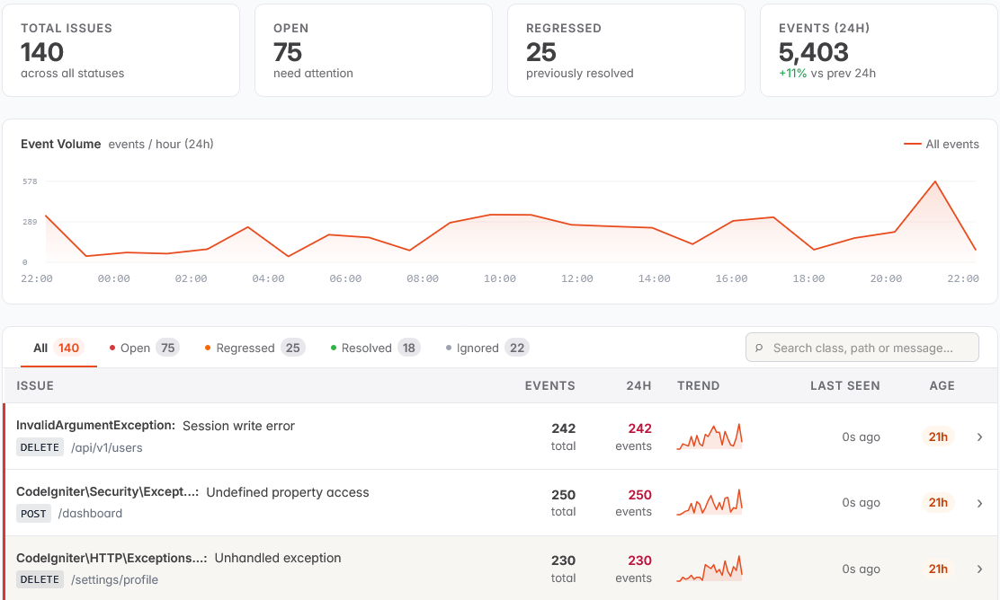
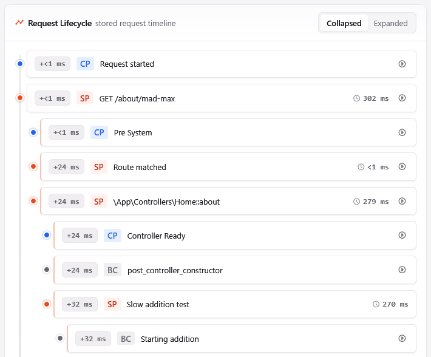

    

<h1 align="center">DEX</h1>

    An open-source, self-hosted issue tracker and request monitor for CodeIgniter 4 applications.

    
    
    
    
    
    
    

    <a href="https://www.dexphp.com/documentation">Get Started</a>
    &nbsp;|&nbsp;
    <a href="https://dex.profusionlabs.org">Demo</a>
    &nbsp;|&nbsp;
    <a href="CONTRIBUTING.md">Contributing</a>

## About DEX

DEX helps you understand what happened inside a CodeIgniter 4 request without digging through scattered logs or guessing which route, query, span, or breadcrumb caused the break.

It captures errors, groups repeat failures into issues, keeps the useful request context, and shows the lifecycle of a request in a self-hosted dashboard built for CI4 projects. The goal is simple: when something fails, DEX should help you move from "something broke" to "this is where it broke" as quickly as possible.

Use DEX to:

- Track application errors and regressions as issues.
- Inspect request timelines, controller flow, spans, breadcrumbs, and slow work.
- See event volume and issue trends from a clean dashboard.
- Keep monitoring close to your application without shipping every detail to a third-party service.

## Screenshots

    

    

## Contributing

DEX is open source, and thoughtful contributions are welcome. If you want to fix a bug, improve the dashboard, tighten the telemetry pipeline, or help with documentation, start with the [contribution guide](CONTRIBUTING.md).

Please keep changes focused and easy to review. Small, well-tested improvements are much easier to merge than broad rewrites.

## Need Help?

If you run into a problem, [open a detailed issue](https://github.com/olajideolamide/dex/issues/new) with the CodeIgniter version, PHP version, DEX version, the steps to reproduce it, and any relevant logs or screenshots.

For questions, ideas, or design discussions, start a new [GitHub Discussion](https://github.com/olajideolamide/dex/discussions). If you believe you have found a security issue, please review the [security policy](security.md) before sharing details publicly.
